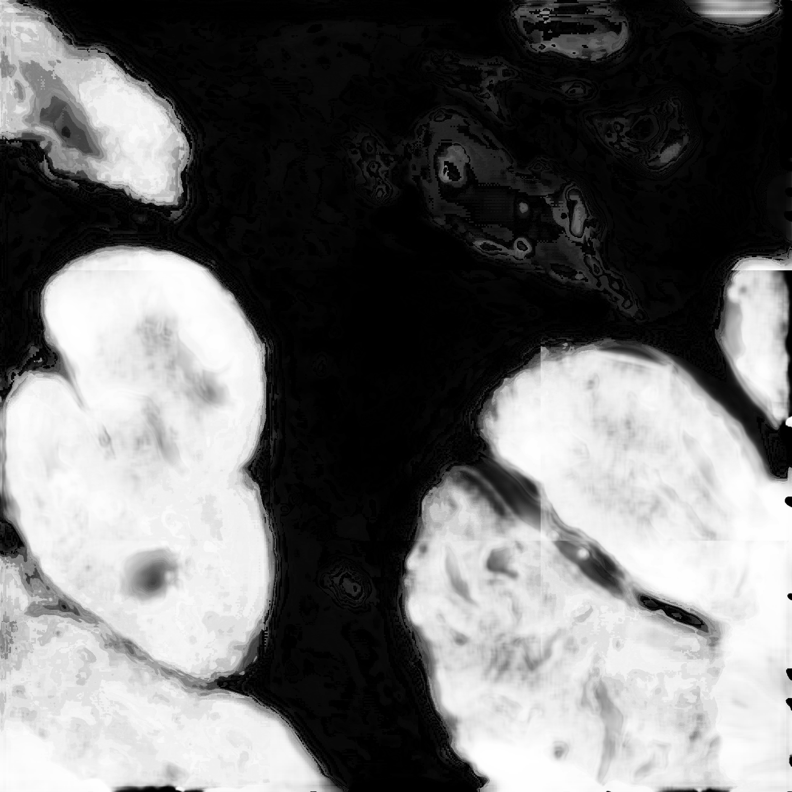
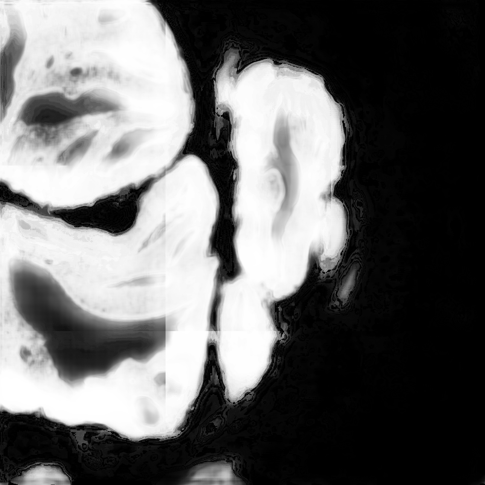
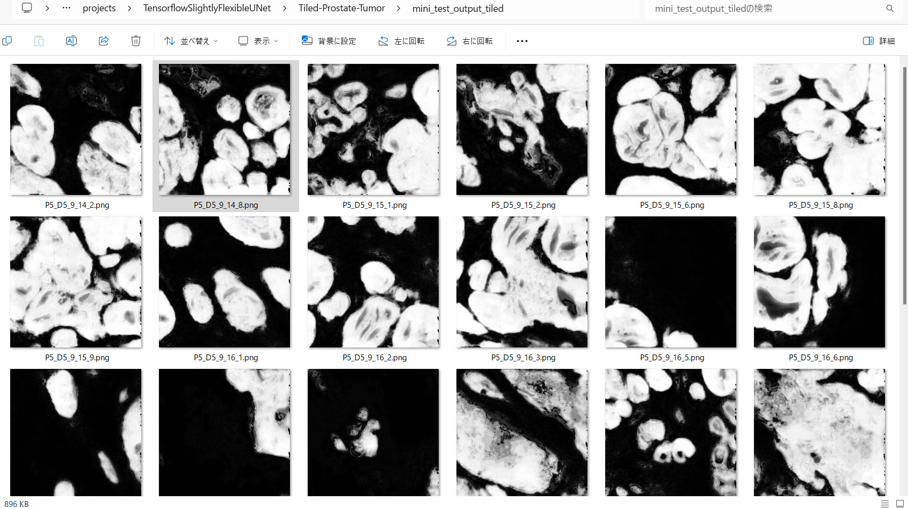

<h2>Tensorflow-Tiled-Image-Segmentation-RINGS-Prostate-Tumor (2024/12/26)</h2>

This is the first experiment of Tiled Image Segmentation for RINGS Prostate Tumor 
 based on 
the latest <a href="https://github.com/sarah-antillia/Tensorflow-Image-Segmentation-API">Tensorflow-Image-Segmentation-API</a>, 
and  <a href="https://drive.google.com/file/d/1cFwfM6C-rO9PrhCd6k19CuGWIN2whUxd/view?usp=sharing">
RINGS-Tiled-Prostate-Tumor-ImageMask-Dataset.zip</a>, which was derived by us from 
<a href="https://data.mendeley.com/datasets/h8bdwrtnr5/1">
<b>
RINGS algorithm dataset 
</b>
</a>

 Please see also: <a href="https://github.com/sarah-antillia/Tensorflow-Image-Segmentation-RINGS-Prostate-Tumor">Tensorflow-Image-Segmentation-RINGS-Prostate-Tumor</a>

 

<b>Actual Tiled Image Segmentation for Images of 1500x1500 pixels</b> 
As shown below, the inferred masks look similar to the ground truth masks.  

<table>
<tr>
<th>Input: image</th>
<th>Mask (ground_truth)</th>
<th>Prediction: inferred_mask</th>
</tr>
<tr>
<td></td>
<td></td>
<td></td>
</tr>

<tr>
<td></td>
<td></td>
<td></td>
</tr>

<tr>
<td></td>
<td></td>
<td></td>
</tr>
</table>

 
In this experiment, we used the simple UNet Model 
<a href="./src/TensorflowUNet.py">TensorflowSlightlyFlexibleUNet</a> for this Prostate-TumorSegmentation Model. 
As shown in <a href="https://github.com/sarah-antillia/Tensorflow-Image-Segmentation-API">Tensorflow-Image-Segmentation-API</a>.
you may try other Tensorflow UNet Models: 

<li><a href="./src/TensorflowSwinUNet.py">TensorflowSwinUNet.py</a></li>
<li><a href="./src/TensorflowMultiResUNet.py">TensorflowMultiResUNet.py</a></li>
<li><a href="./src/TensorflowAttentionUNet.py">TensorflowAttentionUNet.py</a></li>
<li><a href="./src/TensorflowEfficientUNet.py">TensorflowEfficientUNet.py</a></li>
<li><a href="./src/TensorflowUNet3Plus.py">TensorflowUNet3Plus.py</a></li>
<li><a href="./src/TensorflowDeepLabV3Plus.py">TensorflowDeepLabV3Plus.py</a></li>

 

<h3>1. Dataset Citation</h3>
The dataset used here has been take from the following web site 

<a href="https://data.mendeley.com/datasets/h8bdwrtnr5/1">
<b>
RINGS algorithm dataset 
</b>
</a>

 
Published: 15 April 2021 
Version 1 
DOI:10.17632/h8bdwrtnr5.1 
 
<b>Contributors:</b> 
Massimo Salvi, Martino Bosco, Luca Molinaro, Alessandro Gambella, Mauro Giulio Papotti, 
 Udyavara Rajendra Acharya, Filippo Molinari 
 
<b>Description</b> 

This repository contains the image dataset and the manual annotations used to develop the RINGS algorithm for automated prostate glands segmentation: 
 Salvi M., Bosco M., L. Molinaro, Gambella A., Papotti M., Udyavara Rajendra Acharya, and Molinari F.,  
"A hybrid deep learning approach for gland segmentation in prostate histopathological images",  
Artificial Intelligence in Medicine 2021 (DOI: 10.1016/j.artmed.2021.102076)
 
 
Background: In digital pathology, the morphology and architecture of prostate glands have been routinely adopted by pathologists to evaluate the presence of cancer tissue. The manual annotations are operator-dependent, error-prone and time-consuming. The automated segmentation of prostate glands can be very challenging too due to large appearance variation and serious degeneration of these histological structures.
Method: A new image segmentation method, called RINGS (Rapid IdentificatioN of Glandural Structures), is presented to segment prostate glands in histopathological images. We designed a novel glands segmentation strategy using a multi-channel algorithm that exploits and fuses both traditional and deep learning techniques. Specifically, the proposed approach employs a hybrid segmentation strategy based on stroma detection to accurately detect and delineate the prostate glands contours.
Results: Automated results are compared with manual annotations and seven state-of-the-art techniques designed for glands segmentation. Being based on stroma segmentation, no performance degradation is observed when segmenting healthy or pathological structures.  Our method is able to delineate the prostate gland of the unknown histopathological image with a dice score of 90.16% and outperforms all the compared state-of-the-art methods.
Conclusions: To the best of our knowledge, the RINGS algorithm is the first fully automated method capable of maintaining a high sensitivity even in the presence of severe glandular degeneration. The proposed method will help to detect the prostate glands accurately and assist the pathologists to make accurate diagnosis and treatment. The developed model can be used to support prostate cancer diagnosis in polyclinics and community care centres. 
  
<b>Licence</b>: CC BY 4.0 

 
<h3>
<a id="2">
2 Tiled-Prostate-Tumor ImageMask Dataset
</a>
</h3>
 If you would like to train this Prostate-Tumor Segmentation model by yourself,
 please download the dataset from the google drive  
<a href="https://drive.google.com/file/d/1cFwfM6C-rO9PrhCd6k19CuGWIN2whUxd/view?usp=sharing">
RINGS-Tiled-Prostate-Tumor-ImageMask-Dataset.zip</a>
, expand the downloaded ImageMaskDataset and put it under <b>./dataset</b> folder to be
<pre>
./dataset
└─Tiled-Prostate-Tumor
    ├─test
    │   ├─images
    │   └─masks
    ├─train
    │   ├─images
    │   └─masks
    └─valid
        ├─images
        └─masks
</pre>
This is a 512x512 pixels tiles dataset generated from 1500x1500 pixels IMAGES and MANUAL_TUMOR of TRAIN only. 
We excluded all black (empty) masks and their corresponding images to generate our dataset from the original one.   
<pre>
./RINGS
└─TRAIN
    ├─IMAGES
    └─MANUAL TUMOR
</pre>
On the derivation of this tiled dataset, please refer to the following Python scripts. 
<li><a href="./generator/TrainTumorImageMaskDatasetGenerator.py">TrainTumorImageMaskDatasetGenerator.py</a></li>
<li><a href="./generator/TiledImageMaskDatasetGenerator.py">TiledImageMaskDatasetGenerator.py</a></li>
<li><a href="./generator/split_tiled_master.py">split_tiled_master.py</a></li>
 
For example, a 1500x1500 pixels image can be split into 512x512 pixels 9 tiles as shown below. 
<b>1500x1500 pixels image</b> 
<table>
<tr>
<td></td>
</tr>
</table>
 
<b>512x512 pixels tiledly splitted images</b> 
<table>
<tr>
<td></td>
<td></td>
<td></td>
</tr>
<tr>
<td></td>
<td></td>
<td></td>
</tr>
<tr>
<td></td>
<td></td>
<td></td>
</tr>

</table>

 
<b>Tiled-Prostate-Tumor Statistics</b> 
 
 
As shown above, the number of images of train and valid datasets is enough to use for a training set of our segmentation model.
 
 
<b>Train_images_sample</b> 

 
<b>Train_masks_sample</b> 

 

<h3>
3 Train TensorflowUNet Model
</h3>
 We have trained Prostate-Tumor TensorflowUNet Model by using the following
<a href="./projects/TensorflowSlightlyFlexibleUNet/Tiled-Prostate-Tumor/train_eval_infer.config"> <b>train_eval_infer.config</b></a> file.  
Please move to ./projects/TensorflowSlightlyFlexibleUNet/Prostate-Tumorand run the following bat file. 
<pre>
>1.train.bat
</pre>
, which simply runs the following command. 
<pre>
>python ../../../src/TensorflowUNetTrainer.py ./train_eval_infer.config
</pre>

<b>Model parameters</b> 
Enabled Batch Normalization. 
Defined a small <b>base_filters=16</b> and large <b>base_kernels=(9,9)</b> for the first Conv Layer of Encoder Block of 
<a href="./src/TensorflowUNet.py">TensorflowUNet.py</a> 
and a large num_layers (including a bridge between Encoder and Decoder Blocks).
<pre>
[model]
normalization  = True
base_filters   = 16
base_kernels   = (9,9)
num_layers     = 7
dilation       = (1,1)
</pre>

<b>Learning rate</b> 
Defined a small learning rate.  
<pre>
[model]
learning_rate  = 0.0002
</pre>

<b>Online augmentation</b> 
Disabled our online augmentation tool. 
<pre>
[model]
model         = "TensorflowUNet"
generator     = False
</pre>

<b>Loss and metrics functions</b> 
Specified "bce_dice_loss" and "dice_coef". 
<pre>
[model]
loss           = "bce_dice_loss"
metrics        = ["dice_coef"]
</pre>
<b >Learning rate reducer callback</b> 
Enabled learing_rate_reducer callback, and a small reducer_patience.
<pre> 
[train]
learning_rate_reducer = True
reducer_factor     = 0.4
reducer_patience   = 4
</pre>

<b>Dataset class</b> 
Specified ImageMaskDataset class.
<pre>
[dataset]
datasetclass  = "ImageMaskDataset"
resize_interpolation = "cv2.INTER_CUBIC"
</pre>

<b>Early stopping callback</b> 
Enabled early stopping callback with patience parameter.
<pre>
[train]
patience      = 10
</pre>

<b>Epoch change inference callbacks</b> 
Enabled epoch_change_infer callback. 
<pre>
[train]
epoch_change_infer       = False
epoch_change_infer_dir   =  "./epoch_change_infer"
epoch_changeinfer        = True
epoch_changeinfer_dir    = "./epoch_changeinfer"
num_infer_images         = 1
</pre>

By using this callback, on every epoch_change, the inference procedure can be called
 for 1 image in <b>mini_test</b> folder. This will help you confirm how the predicted mask changes 
 at each epoch during your training process.    

<b>Epoch_change_inference output</b> 
 
 

In this experiment, the training process was stopped at epoch 29 by EarlyStopping Callback.  
 
 

<a href="./projects/TensorflowSlightlyFlexibleUNet/Tiled-Prostate-Tumor/eval/train_metrics.csv">train_metrics.csv</a> 
 

 
<a href="./projects/TensorflowSlightlyFlexibleUNet/Tiled-Prostate-Tumor/eval/train_losses.csv">train_losses.csv</a> 
 

 

<h3>
4 Evaluation
</h3>
Please move to a <b>./projects/TensorflowSlightlyFlexibleUNet/Prostate-Tumor</b> folder, 
and run the following bat file to evaluate TensorflowUNet model for Prostate-Tumor. 
<pre>
./2.evaluate.bat
</pre>
This bat file simply runs the following command.
<pre>
python ../../../src/TensorflowUNetEvaluator.py ./train_eval_infer_aug.config
</pre>

Evaluation console output: 

  Image-Segmentation-Prostate-Tumor

<a href="./projects/TensorflowSlightlyFlexibleUNet/Tiled-Prostate-Tumor/evaluation.csv">evaluation.csv</a> 

The loss (bce_dice_loss) to this Prostate-Tumor/test was not low, and dice_coef not so high as shown below.
 
<pre>
loss,0.4375
dice_coef,0.7225
</pre>
 

<h3>
5 Tiled inference
</h3>
Please move to a <b>./projects/TensorflowSlightlyFlexibleUNet/Prostate-Tumor</b> folder 
,and run the following bat file to infer segmentation regions for images by the Trained-TensorflowUNet model for Prostate-Tumor. 
<pre>
./4.tiled_infer.bat
</pre>
This simply runs the following command.
<pre>
python ../../../src/TensorflowUNetTiledInferencer.py ./train_eval_infer.config
</pre>

<b>mini_test_images</b> 
 
<b>mini_test_mask(ground_truth)</b> 
 

<b>Tiled inferred test masks</b> 
 
 

<b>Enlarged images and masks </b> 

<table>
<tr>
<th>Image</th>
<th>Mask (ground_truth)</th>
<th>Tiled-inferred-mask</th>
</tr>

<tr>
<td></td>
<td></td>
<td></td>
</tr>

<tr>
<td></td>
<td></td>
<td></td>
</tr>

<tr>
<td></td>
<td></td>
<td></td>
</tr>
<tr>
<td></td>
<td></td>
<td></td>
</tr>
<tr>
<td></td>
<td></td>
<td></td>
</tr>
<tr>
<td></td>
<td></td>
<td></td>
</tr>
</table>

 

<h3>
References
</h3>
<b>1. RINGS algorithm dataset</b> 
Massimo Salvi, Martino Bosco, Luca Molinaro, Alessandro Gambella, Mauro Giulio Papotti, 
 Udyavara Rajendra Acharya, Filippo Molinari 
DOI:10.17632/h8bdwrtnr5.1 

<a href="https://data.mendeley.com/datasets/h8bdwrtnr5/1">
https://data.mendeley.com/datasets/h8bdwrtnr5/1</a>
 

